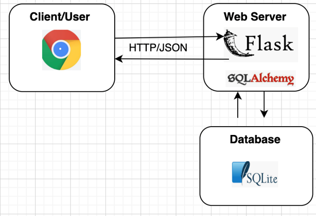

# Crime in Los Angeles: Data Story Telling Using Visualizations

## Table of Contents
- Overview
- Getting Started
- Usage
- Major Findings
- Contributing
- References 

## Overview

The original data reflect incidents of crime in the City of Los Angeles dating from 2010 to present. The data can be found in data.gov website - a government website that provides access to a wide range of public datasets. We used the following two data sets and selected only five years, 2018 to 2022:
1) https://catalog.data.gov/dataset/crime-data-from-2020-to-present
2) https://catalog.data.gov/dataset/crime-data-from-2010-to-2019/resource/7019ef5a-a383-479c-8a28-8175ced9b7f5

These datasets are electronic versions of the original hard copies of all crime reports in Los Angeles metropolitan area. These reports were later transcribed and coded. 

This interactive dashboard has: 
- User-friendly interface that makes it easy for users to navigate and interact with the data. 
- Charts to show frequency of crimes amongst various demographics. 
- Map of Los Angeles City crime rate by location.
- Allows the user to select the year and the type of crime 

## Data Flow Chart

- We extracted, cleaned and merged the CSV files using a Python script (Pandas package)
- We then normalized the data and loaded the tables into a SQLite database
- Data queries were done using SQLAlchemy. 
- Flask is then used to create API endpoints that can be accessed using HTTP requests.
- We passed to Flask the processed data in a json format
- The interactive dashboard website was built using HTML and CSS.
- Java script is used to send requests to the Flask app and generate charts. 

## Getting Started  

Prerequisites

What you need to install before running the software. 
- Python 3.x
- Flask
- SQLAlchemy
- Pandas
- Falsk-CORS**

** To get rid of a CORS error, you can download a browser extension like CORS Unblock. The extension appends Access-Control-Allow-Origin: * to every HTTP response when it is enabled. It can also add custom Access-Control-Allow-Origin and Access-Control-Allow-Methods headers to the responses.

## Usage 

To use this project, follow these steps:

1.	Clone this repository to your local machine.
2.	Install the necessary dependencies.
3.	Run the Flask server app (flask_app.py).
4.  Open the web page (index.html) and explore the visualizations.

## Major Findings

- When looking at child maltreatment girls are more affected at 59% compared to boys at 41%. 
- Domestic violence is more prevalent amongst females than males. 
- In 2022, 77% of reported domestic violence cases were from females. 
- Overall crime dropped in 2020. This could be due to the lockdown. It picked up in late 2021 and 2022.
- Theft, robbery, and burglary are the highest crimes in LA followed by assault.
- Extortion and vehicle theft are the least crimes. 
- Most of the theft, burglary, and assault victims are males.
- Hispanics are the largest numbers of victims in LA followed by whites. 
- The crime data shows Asians are less affected by crime in LA compared to other races. 

The following charts were obtained using Python Pandas and Matplotlib and are in addition to what is presented on the interactive dashboard:

## Contributing

How to contribute to the project and any relevant information.

1.	Fork the repository.
2.	Make your changes.
3.	Submit a pull request.

## References 
Data for this dataset was obtained from https://catalog.data.gov/. 
https://catalog.data.gov/dataset/crime-data-from-2020-to-present
https://catalog.data.gov/dataset/crime-data-from-2010-to-2019/resource/7019ef5a-a383-479c-8a28-8175ced9b7f5
